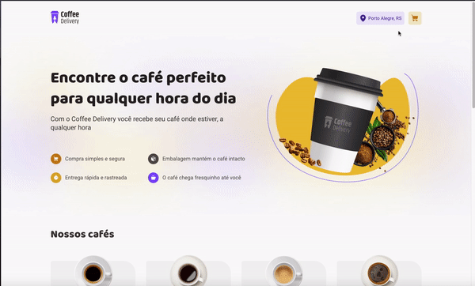

<h1 align='center'>
    
</h1>

<p align="center">Coffee Delivery built with ReactJS and Styled-Components</p>

<p align="center">
   <a href="https://github.com/gustavonobrega">
    
   </a>
</p>

<p align="center">
  
</p>

<hr />

## 🚀 Technologies

This project was developed with the following technologies:

- [Vite](https://vitejs.dev/)
- [ReactJS](https://reactjs.org/)
- [React Router Dom](https://reactrouter.com/)
- [TypeScript](https://www.typescriptlang.org/)
- [Styled-Components](https://styled-components.com/)
- [React Hook Form](https://react-hook-form.com/)
- [Zod](https://zod.dev/)
- [Immer](https://immerjs.github.io/immer/)
- [Phosphor Icons](https://phosphoricons.com/)
- [ESLint](https://eslint.org/)


## 💻  Getting started

```bash
# Clone this repository
$ git clone https://github.com/gustavonobrega/challenge-coffee-delivery

# Go into the repository
$ cd challenge-coffee-delivery

# Install dependencies
$ npm install

# Run the app
$ npm run dev
```

---

Made with ♥ by Gustavo Nobrega